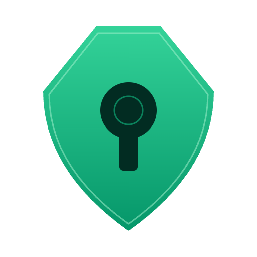
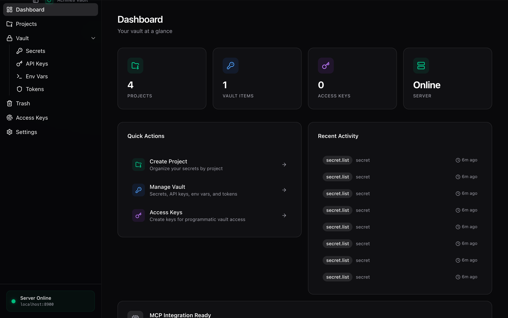
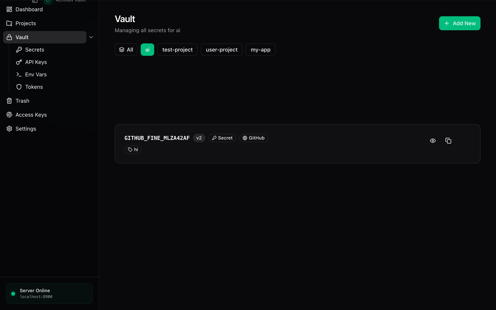
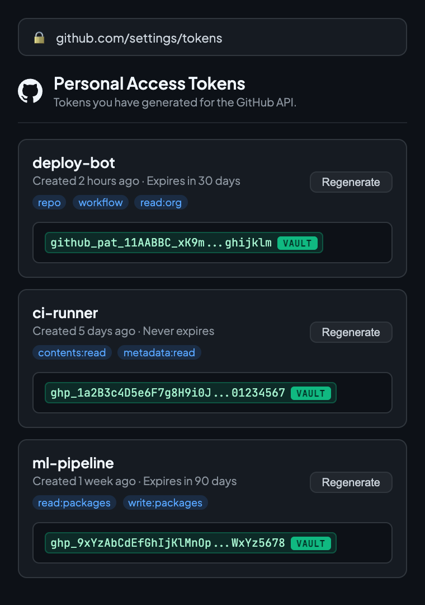
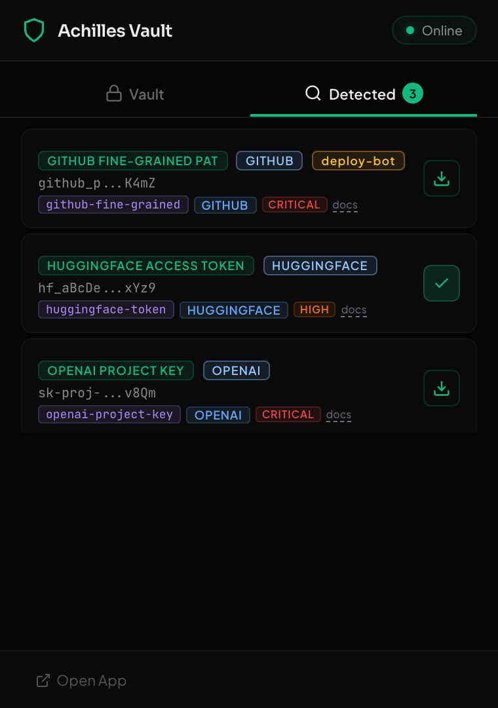

<p align="center">
  
</p>

<h1 align="center">Achilles Vault</h1>

<p align="center">
  <strong>Open-source, local-first secret management for the AI era.</strong><br/>
  Your personal Akeyless / Infisical that runs locally and speaks MCP.
</p>

<p align="center">
  <a href="#quick-start"></a>
  
  
  
  
  
</p>

<p align="center">
  
  
  
  
  
</p>

---

## Why Achilles?

In the age of AI, automation is everywhere. We use **GitHub Actions**, **Hugging Face Spaces**, **Vercel**, **AWS**, and countless CI/CD platforms daily — and every single one requires **tokens, API keys, and secrets** to grant permissions and authorize access.

As AI agents become our co-pilots — writing code, deploying services, running pipelines — they need **secure, structured access** to our credentials. But today, most developers still manage secrets by:

- Pasting tokens into `.env` files scattered across projects
- Storing API keys in plaintext notes or browser bookmarks
- Losing track of which token has which permissions on which platform

**Achilles Vault** solves this. It's an **open-source, local-first secret manager** purpose-built for AI-era workflows:

> **Store once. Organize by project. Let AI agents fetch what they need — securely, locally, with a full audit trail.**

No cloud dependency. No vendor lock-in. Your secrets never leave your machine.

---

## Screenshots

<table>
<tr>
<td width="50%">

**Desktop App — Dashboard**



*Real-time overview of projects, secrets, API keys, and audit activity.*

</td>
<td width="50%">

**Desktop App — Vault**



*Manage secrets across dev / staging / production environments.*

</td>
</tr>
<tr>
<td width="50%">

**Chrome Extension — Auto-Detect**



*Automatically detects API keys on GitHub, HuggingFace, and 12+ platforms.*

</td>
<td width="50%">

**Chrome Extension — Rule Hit Log**



*Shows which detection rule matched, severity level, and platform.*

</td>
</tr>
</table>

> **Note:** If screenshots are not yet available, build and run the app to see the UI in action.

---

## Features

### Core Vault

| Feature | Description |
|---------|-------------|
| **AES-256-GCM Encryption** | All secrets encrypted at rest with authenticated encryption, per-secret random salt and nonce |
| **Project / Environment Hierarchy** | Organize secrets by project with `development`, `staging`, and `production` environments |
| **Secret Versioning** | Full version history with one-click rollback |
| **Audit Logging** | Immutable record of every vault operation (who, what, when) |
| **JWT + API Key Auth** | Dual authentication — JWT for interactive sessions, API keys for machines and agents |
| **Zero Dependencies** | SQLite-based. No PostgreSQL, no Redis, no external services. Just run it. |

### AI-Native Integration

| Feature | Description |
|---------|-------------|
| **MCP Protocol** | Model Context Protocol server on port 8901 — AI agents can discover and fetch secrets natively |
| **OpenAI Function Calling** | Auto-generated function schemas at `/api/v1/ai/openai/functions` |
| **Simple AI Endpoint** | `POST /api/v1/ai/secrets` — one call to fetch multiple secrets by key name |
| **`achilles run`** | Inject secrets as environment variables into any command (like `doppler run`) |

### Chrome Extension

| Feature | Description |
|---------|-------------|
| **Auto-Detection** | Scans web pages for 30+ secret patterns (GitHub PAT, HuggingFace tokens, AWS keys, etc.) |
| **Rule-Based Engine** | Externalized [`rules.json`](chrome-extension/rules/rules.json) with rule ID, platform, severity, and documentation links |
| **One-Click Import** | Detected token → click "vault" badge → stored encrypted with metadata |
| **Auto-Fill** | Fill secrets into token fields on GitHub, HuggingFace, Vercel, OpenAI, and 12+ platforms |
| **Rule Hit Log** | Popup shows which rule matched each detection, with severity and platform info |

### Desktop App (Tauri v2)

| Feature | Description |
|---------|-------------|
| **Native macOS App** | Tauri v2 desktop app with overlay titlebar and native performance |
| **Dashboard** | Overview of projects, secret counts, recent audit activity, server status |
| **Dark Theme** | Designed for developers — full dark UI with JetBrains Mono |
| **Deep Link** | `achillesvault://open` — launch from Chrome extension or terminal |

---

## Quick Start

### Prerequisites

- **Python 3.11+** — for the backend server
- **Node.js 18+** — for the frontend (optional, for desktop app)
- **Rust** — for Tauri desktop build (optional)

### 1. Install the Backend

```bash
# Clone the repository
git clone https://github.com/tao-shen/achilles.git
cd achilles

# Install Python package
pip install -e .

# Start the server (port 8900)
achilles serve
```

### 2. First-Time Setup

```bash
# Register the first user (becomes admin)
achilles register -U admin -P your-secure-password

# Login
achilles login -U admin -P your-secure-password

# Create your first project
achilles create-project my-ai-project
```

### 3. Store & Retrieve Secrets

```bash
# Store secrets
achilles set <project-id> OPENAI_API_KEY sk-xxx --env development
achilles set <project-id> HF_TOKEN hf_xxx --env development
achilles set <project-id> GITHUB_TOKEN ghp_xxx --env production

# Retrieve
achilles get <project-id> OPENAI_API_KEY --env development

# Run a command with secrets injected as env vars
achilles run <project-id> --env production -- python train.py

# Export as .env file
achilles export <project-id> --env production > .env
```

### 4. Install Chrome Extension

```bash
# 1. Open chrome://extensions
# 2. Enable "Developer mode"
# 3. Click "Load unpacked"
# 4. Select the chrome-extension/ directory
```

### 5. Launch Desktop App (Optional)

```bash
cd frontend
npm install
npx tauri dev
```

---

## Architecture

```
achilles/
├── achilles/                    # Python backend
│   ├── main.py                  # FastAPI server (port 8900)
│   ├── crypto.py                # AES-256-GCM encryption layer
│   ├── database.py              # SQLite with async support
│   ├── auth.py                  # JWT + API key authentication
│   ├── mcp_server.py            # MCP protocol server (port 8901)
│   ├── routers/
│   │   ├── secrets_router.py    # Secret CRUD operations
│   │   ├── projects_router.py   # Project & environment management
│   │   ├── ai_router.py         # MCP + OpenAI function calling
│   │   ├── auth_router.py       # Registration & login
│   │   ├── audit_router.py      # Audit log
│   │   └── trash_router.py      # Soft delete & recovery
│   └── cli/
│       └── main.py              # Typer CLI tool
│
├── frontend/                    # React + Tauri v2
│   ├── src/
│   │   ├── pages/               # Dashboard, Vault, Secrets, Settings, ...
│   │   ├── components/          # Layout, UI components (shadcn/ui)
│   │   ├── store/               # Zustand state management
│   │   └── api/                 # API client
│   └── src-tauri/               # Tauri Rust backend & config
│
├── chrome-extension/            # Chrome Extension (Manifest V3)
│   ├── manifest.json
│   ├── rules/
│   │   └── rules.json           # 30+ detection rules with metadata
│   ├── content/
│   │   └── detector.js          # Pattern matching & page scanning
│   ├── background/
│   │   └── service-worker.js    # Message routing & API bridge
│   └── popup/
│       ├── popup.html/js/css    # Extension popup UI
│
└── pyproject.toml               # Python project configuration
```

---

## API Reference

### REST API (v1)

**Base URL:** `http://localhost:8900`

| Method | Endpoint | Description |
|--------|----------|-------------|
| `POST` | `/api/v1/auth/register` | Register new user |
| `POST` | `/api/v1/auth/login` | Get JWT token |
| `POST` | `/api/v1/auth/api-keys` | Create API key |
| `GET` | `/api/v1/projects` | List projects |
| `POST` | `/api/v1/projects` | Create project |
| `GET` | `/api/v1/projects/{id}/environments/{env}/secrets` | List secrets (metadata only) |
| `PUT` | `/api/v1/projects/{id}/environments/{env}/secrets/{key}` | Create or update a secret |
| `GET` | `/api/v1/projects/{id}/environments/{env}/secrets/{key}` | Get decrypted secret value |
| `DELETE` | `/api/v1/projects/{id}/environments/{env}/secrets/{key}` | Delete secret (soft delete) |

### AI Integration Endpoints

| Method | Endpoint | Description |
|--------|----------|-------------|
| `POST` | `/api/v1/ai/secrets` | Fetch multiple secrets in one call |
| `GET` | `/api/v1/ai/mcp/tools` | List available MCP tools |
| `POST` | `/api/v1/ai/mcp/call` | Execute an MCP tool call |
| `GET` | `/api/v1/ai/openai/functions` | Get OpenAI function calling schemas |

### Usage with AI Agents

```python
import httpx

# Fetch secrets for your AI pipeline
resp = httpx.post(
    "http://localhost:8900/api/v1/ai/secrets",
    headers={"X-API-Key": "av_your_api_key"},
    json={
        "project": "my-ai-project",
        "environment": "production",
        "keys": ["OPENAI_API_KEY", "HF_TOKEN", "GITHUB_TOKEN"]
    }
)
secrets = resp.json()["secrets"]
# {"OPENAI_API_KEY": "sk-...", "HF_TOKEN": "hf_...", "GITHUB_TOKEN": "ghp_..."}
```

```python
# MCP tool call (for MCP-compatible agents)
resp = httpx.post(
    "http://localhost:8900/api/v1/ai/mcp/call",
    headers={"X-API-Key": "av_your_api_key"},
    json={
        "name": "get_secret",
        "arguments": {"project": "my-ai-project", "key": "OPENAI_API_KEY"}
    }
)
```

---

## Chrome Extension — Detection Rules

Achilles includes a rule-based secret detection engine. All rules are defined in [`chrome-extension/rules/rules.json`](chrome-extension/rules/rules.json) — human-readable, editable, and extensible.

### Supported Platforms

| Platform | Rules | Token Types |
|----------|-------|-------------|
| **GitHub** | 4 | PAT (classic), OAuth, App, Fine-grained PAT |
| **HuggingFace** | 1 | User Access Token |
| **OpenAI** | 2 | API Key, Project-scoped Key |
| **Anthropic** | 1 | API Key |
| **AWS** | 2 | Access Key ID, Secret Access Key |
| **GitLab** | 1 | Personal Access Token |
| **Stripe** | 3 | Live Secret, Test Secret, Publishable Key |
| **Slack** | 2 | Bot Token, User Token |
| **Google** | 1 | API Key |
| **Vercel** | 1 | API Token |
| **Supabase** | 1 | Service Key |
| **Groq** | 1 | API Key |
| **Replicate** | 1 | API Token |
| **NPM** | 1 | Access Token |
| **PyPI** | 1 | API Token |
| **Firebase** | 1 | Server Key |
| **Discord** | 1 | Bot Token |
| **Generic** | 1 | JWT (context-aware) |
| | **30 total** | |

### Rule Schema

Each rule in `rules.json` follows this structure:

```json
{
  "id": "github-pat",
  "name": "GitHub Personal Access Token",
  "platform": "GitHub",
  "pattern": "\\bghp_[A-Za-z0-9]{36,}\\b",
  "flags": "g",
  "severity": "critical",
  "description": "GitHub classic personal access token (ghp_...).",
  "contextRequired": false,
  "reference": "https://docs.github.com/en/authentication/..."
}
```

### Adding Custom Rules

Simply edit `rules.json` to add your own patterns:

```json
{
  "id": "my-internal-token",
  "name": "Internal Service Token",
  "platform": "MyCompany",
  "pattern": "\\bmc_[A-Za-z0-9]{32,}\\b",
  "flags": "g",
  "severity": "high",
  "description": "Internal microservice authentication token.",
  "contextRequired": false
}
```

Reload the extension — the new rule is active immediately.

---

## Security

| Layer | Implementation |
|-------|---------------|
| **Encryption** | AES-256-GCM with authenticated encryption |
| **Key Derivation** | scrypt (memory-hard KDF) |
| **Salt & Nonce** | Per-secret random values — no ciphertext reuse |
| **Master Key** | Never stored on disk, derived at runtime |
| **Authentication** | JWT (configurable expiry) + API keys (scoped) |
| **Rate Limiting** | Auth endpoints rate-limited (5 reg/min, 10 login/min) |
| **Audit Trail** | Immutable log of every vault operation |
| **Local-Only** | All data stays on your machine. Zero cloud calls. |

---

## Configuration

| Environment Variable | Default | Description |
|---------------------|---------|-------------|
| `ACHILLES_MASTER_KEY` | random | Master encryption key |
| `ACHILLES_JWT_SECRET` | random | JWT signing secret |
| `ACHILLES_HOST` | `127.0.0.1` | Server bind address |
| `ACHILLES_PORT` | `8900` | Server port |

---

## Docker

```bash
docker build -t achilles-vault .
docker run -p 8900:8900 \
  -v achilles-data:/root/.achilles \
  -e ACHILLES_MASTER_KEY=your-master-key \
  achilles-vault
```

---

## Comparison

| Feature | Achilles Vault | Akeyless | Infisical | Doppler |
|---------|:-------------:|:--------:|:---------:|:-------:|
| Open Source | **MIT** | No | MIT | No |
| Local-First | **Yes** | No (SaaS) | Self-host | No (SaaS) |
| AI / MCP Native | **Yes** | SecretlessAI | MCP Server | No |
| Chrome Extension | **Yes** | No | No | No |
| Zero Config | **SQLite** | SaaS + Gateway | PostgreSQL + Redis | SaaS |
| Encryption | AES-256-GCM | DFC (patented) | AES-256-GCM | Managed |
| Secret Detection | **30+ rules** | No | No | No |
| Cost | **Free** | Paid | Free tier | Paid |

---

## Tech Stack

<p>
  
  
  
  
  
  
  
  
  
</p>

---

## Contributing

Contributions are welcome! Please feel free to submit a Pull Request.

```bash
# Development setup
git clone https://github.com/tao-shen/achilles.git
cd achilles

# Backend
pip install -e ".[dev]"
pytest

# Frontend
cd frontend
npm install
npm run dev

# Lint
ruff check achilles/
```

---

## Roadmap

- [ ] Team sharing with encrypted key exchange
- [ ] Secret rotation policies & expiry alerts
- [ ] VS Code extension
- [ ] `achilles inject` for Dockerfile / docker-compose
- [ ] RBAC with fine-grained permissions
- [ ] Biometric unlock (Touch ID / Windows Hello)
- [ ] Browser extension for Firefox & Edge

---

## License

[MIT](LICENSE) — free for personal and commercial use.

---

<p align="center">
  
  <br/>
  <sub>Built for developers who ship with AI.</sub>
</p>
