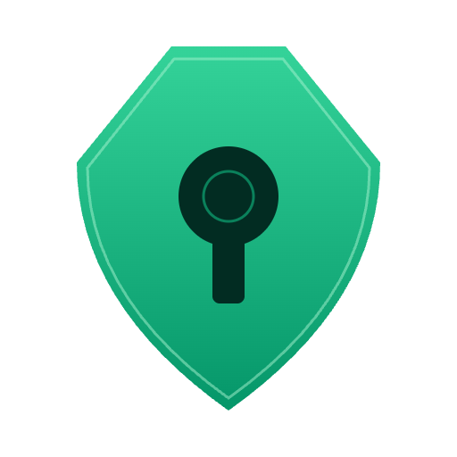
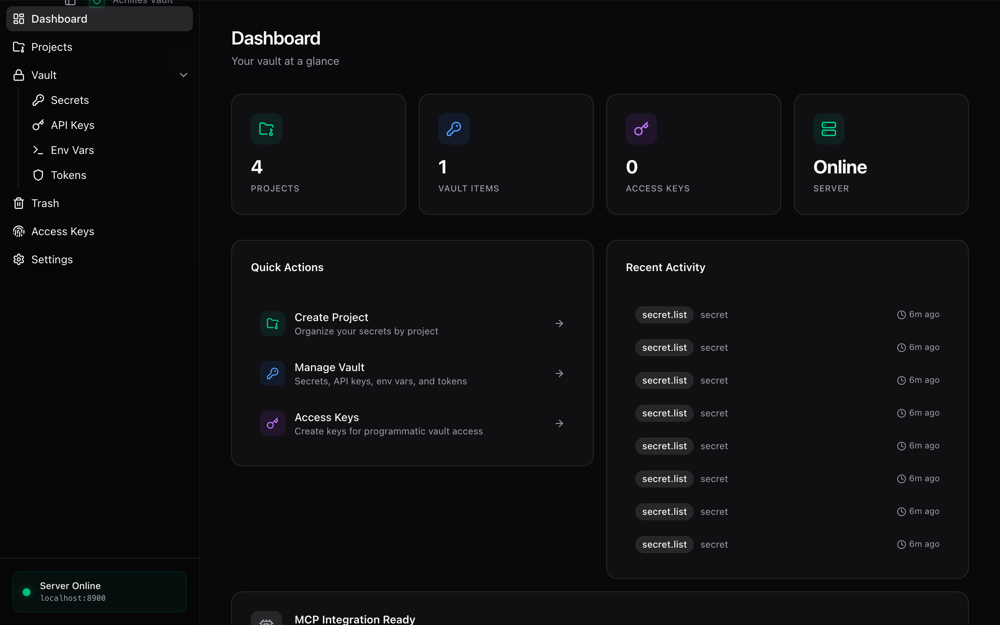
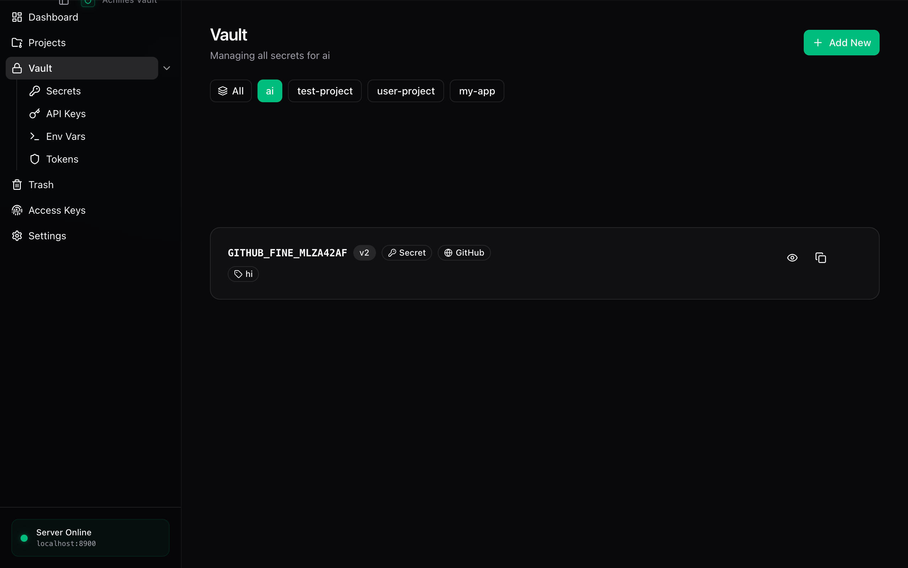
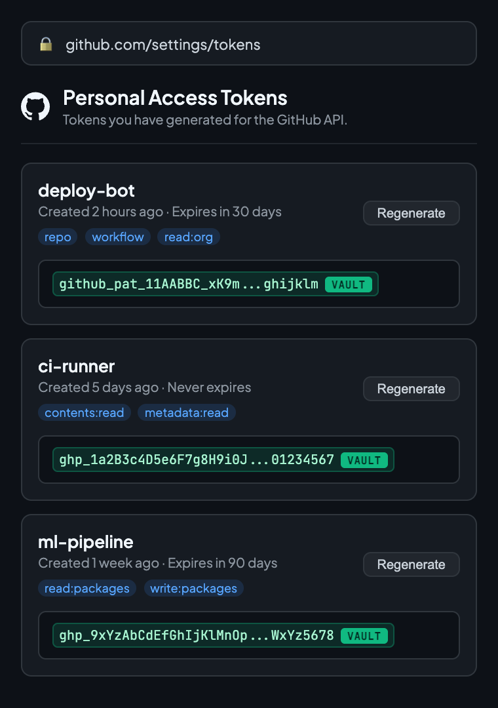
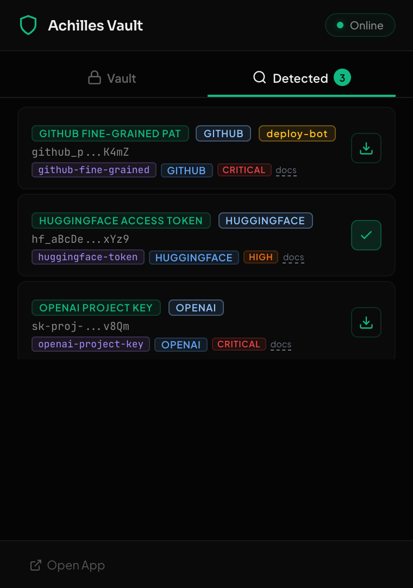

<p align="center">
  
</p>

<h1 align="center">Achilles Vault</h1>

<p align="center">
  <strong>The secret manager your AI agents can actually use.</strong><br/>
  Local-first &middot; MCP-native &middot; Zero cloud dependency
</p>

<p align="center">
  <a href="https://github.com/tao-shen/Achilles/releases/latest"></a>&nbsp;
  <a href="LICENSE"></a>&nbsp;
  <a href="https://github.com/tao-shen/Achilles/stargazers"></a>&nbsp;
  <a href="https://github.com/tao-shen/Achilles/releases"></a>
</p>

<p align="center">
  
  
  
  
  
  
  
  
</p>

<br/>

<p align="center">
  <a href="#-quick-start">Quick Start</a> &nbsp;&bull;&nbsp;
  <a href="#-screenshots">Screenshots</a> &nbsp;&bull;&nbsp;
  <a href="#-why-achilles">Why Achilles</a> &nbsp;&bull;&nbsp;
  <a href="#-ai-native-integration">AI Integration</a> &nbsp;&bull;&nbsp;
  <a href="#-chrome-extension">Chrome Extension</a> &nbsp;&bull;&nbsp;
  <a href="#-api-reference">API</a> &nbsp;&bull;&nbsp;
  <a href="#-contributing">Contributing</a>
</p>

---

## The Problem

You're building with AI. Your stack looks like this:

```
Claude Code  ->  deploys to Vercel  ->  trains on HuggingFace  ->  calls OpenAI  ->  pushes to GitHub
```

Each platform needs a token. You have 20+ API keys scattered across `.env` files, sticky notes, and browser bookmarks. Every time your AI agent needs one, **you stop what you're doing and paste it manually**.

Some developers paste keys directly into prompts. That's a security incident waiting to happen.

## The Solution

**Achilles Vault** is an open-source, local-first secret manager purpose-built for AI-powered development workflows.

Store your secrets once. Your AI agents fetch them securely via **MCP (Model Context Protocol)** — no manual copy-paste, no plaintext in prompts, no cloud dependency.

```
# Before Achilles
You:    "Deploy my app to Vercel"
Claude: "I need your VERCEL_TOKEN"
You:    *opens browser, navigates to dashboard, copies token, pastes into chat*

# After Achilles
You:    "Deploy my app to Vercel"
Claude: *calls achilles.get_secret("VERCEL_TOKEN") via MCP*
Done.
```

> **Your secrets never leave your machine. Not to Achilles servers. Not to anyone.**

---

## Screenshots

<table>
<tr>
<td width="50%">

**Desktop App — Dashboard**



Real-time overview of projects, secrets, API keys, and audit activity.

</td>
<td width="50%">

**Desktop App — Vault**



Manage secrets across dev / staging / production environments.

</td>
</tr>
<tr>
<td width="50%">

**Chrome Extension — Auto-Detect**



Automatically detects API keys on GitHub, HuggingFace, and 12+ platforms.

</td>
<td width="50%">

**Chrome Extension — Rule Hit Log**



Shows matched detection rule, severity level, and platform source.

</td>
</tr>
</table>

---

## Why Achilles

<table>
<tr>
<td width="33%" align="center">
<h3>Local-First</h3>
All data stays on your machine. SQLite-only. Zero cloud calls, zero external dependencies. You own your data.
</td>
<td width="33%" align="center">
<h3>AI-Native</h3>
Built-in MCP server lets Claude Code, Claude Desktop, and any MCP-compatible agent retrieve secrets natively — no custom glue code.
</td>
<td width="33%" align="center">
<h3>Military-Grade Encryption</h3>
AES-256-GCM with per-secret random salt and nonce. Master key derived via scrypt and never stored on disk.
</td>
</tr>
<tr>
<td width="33%" align="center">
<h3>131 Platform Presets</h3>
Create a project and get 388 pre-configured secret keys across AWS, OpenAI, Stripe, GitHub, and 127 more platforms — properly categorized and ready to fill.
</td>
<td width="33%" align="center">
<h3>Chrome Extension</h3>
30+ detection rules scan pages in real time. See a token on GitHub? One click to vault it — encrypted, tagged, and organized.
</td>
<td width="33%" align="center">
<h3>Full Audit Trail</h3>
Immutable log of every vault operation. Know who accessed what, when, from where. Configurable severity levels.
</td>
</tr>
</table>

### How Achilles Compares

| Feature | **Achilles Vault** | Doppler | Infisical | 1Password |
|---------|:-:|:-:|:-:|:-:|
| Open Source | **MIT** | No | MIT | No |
| Local-First | **Yes** | SaaS | Self-host | SaaS |
| AI / MCP Native | **Yes** | No | Partial | No |
| Chrome Secret Detection | **Yes** | No | No | No |
| Platform Presets (131) | **Yes** | No | No | No |
| `run` Command (env injection) | **Yes** | Yes | Yes | No |
| Zero Config | **SQLite** | SaaS | Postgres + Redis | SaaS |
| Cost | **Free** | Paid | Free tier | Paid |

---

## Quick Start

### Prerequisites

- **Python 3.11+**
- Node.js 18+ *(optional, for desktop app)*
- Rust *(optional, for desktop build)*

### 1. Install & Start

```bash
git clone https://github.com/tao-shen/Achilles.git
cd Achilles

pip install -e .
achilles serve          # API on :8900, MCP on :8901
```

### 2. Register & Store Secrets

```bash
achilles register -U admin -P your-password
achilles login -U admin -P your-password

achilles create-project my-ai-project

achilles set <project-id> OPENAI_API_KEY sk-xxx --env production
achilles set <project-id> HF_TOKEN hf_xxx --env production
achilles set <project-id> GITHUB_TOKEN ghp_xxx --env production
```

### 3. Connect Your AI Agent

```python
# Fetch secrets in any AI pipeline
import httpx

secrets = httpx.post(
    "http://localhost:8900/api/v1/ai/secrets",
    headers={"X-API-Key": "av_your_api_key"},
    json={
        "project": "my-ai-project",
        "environment": "production",
        "keys": ["OPENAI_API_KEY", "HF_TOKEN", "GITHUB_TOKEN"]
    }
).json()["secrets"]
```

```bash
# Or inject as environment variables
achilles run <project-id> --env production -- python train.py
```

### 4. Install Chrome Extension *(optional)*

1. Open `chrome://extensions` and enable **Developer mode**
2. Click **Load unpacked** and select the `chrome-extension/` directory
3. Browse to GitHub, HuggingFace, or Vercel — Achilles auto-detects tokens and offers to vault them

### 5. Launch Desktop App *(optional)*

```bash
cd frontend && npm install && npx tauri dev
```

Or download a pre-built binary from [Releases](https://github.com/tao-shen/Achilles/releases).

---

## AI-Native Integration

### MCP Protocol

Achilles runs a **Model Context Protocol server on port 8901**. Configure once — your AI agent discovers and retrieves secrets natively.

```json
// Claude Desktop / Claude Code — mcp config
{
  "mcpServers": {
    "achilles": {
      "url": "http://localhost:8901"
    }
  }
}
```

Available MCP tools: `get_secret`, `list_projects`, `list_secrets`, and more — callable directly within the conversation.

### OpenAI Function Calling

Auto-generated schemas at `/api/v1/ai/openai/functions` — drop into any OpenAI-compatible agent with zero configuration.

### `achilles run` — Inject Secrets Without Code Changes

```bash
achilles run my-project --env production -- python train.py
achilles run my-project --env staging -- docker-compose up
achilles run my-project --env production -- node server.js

# Or export to .env
achilles export my-project --env production > .env
```

No code changes. No secrets in source control. Works with any tool or script.

---

## Chrome Extension

The Chrome extension scans pages for 30+ secret patterns in real time:

1. A badge appears on the Achilles icon when a secret is detected
2. Click **Vault** — the token is stored encrypted with full metadata
3. Auto-fill it back into any supported platform's token field later

### Supported Platforms

| Platform | Token Types |
|----------|------------|
| GitHub | PAT (classic, fine-grained), OAuth, App |
| HuggingFace | User Access Token |
| OpenAI | API Key, Project-scoped Key |
| Anthropic | API Key |
| AWS | Access Key ID + Secret Access Key |
| Stripe | Live, Test, Publishable |
| Vercel, Supabase, Slack | API Token, Service Key, Bot Token |
| Google, GitLab, Discord | API Key, PAT, Bot Token |
| Groq, Replicate, NPM, PyPI, Firebase | Various |

All rules live in [`chrome-extension/rules/rules.json`](chrome-extension/rules/rules.json) — human-readable, editable, extensible.

---

## Core Features

| Feature | Description |
|---------|-------------|
| **AES-256-GCM Encryption** | All secrets encrypted at rest with per-secret random salt and nonce |
| **Project / Environment Hierarchy** | Organize by project with `development`, `staging`, `production` environments |
| **6 Secret Categories** | API Keys, Tokens, Passwords, Certificates, Env Variables, Identifiers |
| **131 Platform Presets** | Pre-configured keys for AWS, GCP, Azure, OpenAI, Stripe, and 126 more |
| **Secret Versioning** | Full version history with one-click rollback |
| **Audit Logging** | Immutable record of every operation — who, what, when, with severity levels |
| **JWT + API Key Auth** | JWT for interactive sessions, API keys for agents and CI/CD |
| **Soft Delete & Recovery** | Deleted secrets go to trash — recoverable until permanently purged |
| **Zero External Dependencies** | SQLite only. No PostgreSQL, no Redis, no cloud services |

---

## Security

| Layer | Implementation |
|-------|---------------|
| **Encryption** | AES-256-GCM with authenticated encryption |
| **Key Derivation** | scrypt (memory-hard KDF) |
| **Salt & Nonce** | Per-secret random values — no reuse |
| **Master Key** | Never stored on disk — derived at runtime |
| **Authentication** | JWT (configurable expiry) + scoped API keys |
| **Rate Limiting** | 5 registrations/min, 10 logins/min on auth endpoints |
| **Audit Trail** | Immutable, append-only log of every vault operation |
| **Local-Only** | All data stays on your machine. Zero cloud calls |

---

## API Reference

**Base URL:** `http://localhost:8900`

| Method | Endpoint | Description |
|--------|----------|-------------|
| `POST` | `/api/v1/auth/register` | Register new user |
| `POST` | `/api/v1/auth/login` | Get JWT token |
| `POST` | `/api/v1/auth/api-keys` | Create API key |
| `GET` | `/api/v1/projects` | List projects |
| `POST` | `/api/v1/projects` | Create project |
| `GET` | `/api/v1/projects/{id}/environments/{env}/secrets` | List secrets (metadata) |
| `PUT` | `/api/v1/projects/{id}/environments/{env}/secrets/{key}` | Create or update secret |
| `GET` | `/api/v1/projects/{id}/environments/{env}/secrets/{key}` | Get decrypted value |
| `DELETE` | `/api/v1/projects/{id}/environments/{env}/secrets/{key}` | Soft delete secret |
| `POST` | `/api/v1/ai/secrets` | Batch fetch secrets (for AI agents) |
| `GET` | `/api/v1/ai/mcp/tools` | List MCP tools |
| `POST` | `/api/v1/ai/mcp/call` | Execute MCP tool call |
| `GET` | `/api/v1/ai/openai/functions` | OpenAI function calling schemas |

---

## Architecture

```
achilles/
├── achilles/                    # Python backend (FastAPI + Uvicorn)
│   ├── main.py                  # Server entry (API :8900, MCP :8901)
│   ├── crypto.py                # AES-256-GCM encryption engine
│   ├── database.py              # Async SQLite with connection pooling
│   ├── auth.py                  # JWT + API key authentication
│   ├── mcp_server.py            # MCP protocol server
│   ├── platforms/               # 131 platform preset definitions
│   ├── routers/
│   │   ├── secrets_router.py    # Secret CRUD operations
│   │   ├── projects_router.py   # Project & environment management
│   │   ├── platforms_router.py  # Platform preset catalog
│   │   ├── ai_router.py         # MCP + OpenAI function calling
│   │   ├── auth_router.py       # Registration & login
│   │   ├── audit_router.py      # Audit log with severity filtering
│   │   └── trash_router.py      # Soft delete & recovery
│   └── cli/
│       └── main.py              # Typer CLI (serve, set, run, export)
│
├── frontend/                    # React 19 + Vite + Tauri v2
│   ├── src/
│   │   ├── pages/               # Dashboard, Vault, Projects, Settings
│   │   ├── components/          # Layout, shadcn/ui component library
│   │   ├── store/               # Zustand state management
│   │   ├── lib/                 # Shared constants & utilities
│   │   └── api/                 # Type-safe API client
│   └── src-tauri/               # Tauri Rust backend & native config
│
└── chrome-extension/            # Manifest V3 Chrome Extension
    ├── rules/rules.json         # 30+ secret detection rules
    ├── content/detector.js      # Real-time page scanning
    ├── background/service-worker.js
    └── popup/                   # Extension popup UI
```

---

## Docker

```bash
docker build -t achilles-vault .
docker run -p 8900:8900 \
  -v achilles-data:/root/.achilles \
  -e ACHILLES_MASTER_KEY=your-master-key \
  achilles-vault
```

## Configuration

| Variable | Default | Description |
|----------|---------|-------------|
| `ACHILLES_MASTER_KEY` | random | Master encryption key |
| `ACHILLES_JWT_SECRET` | random | JWT signing secret |
| `ACHILLES_HOST` | `127.0.0.1` | Server bind address |
| `ACHILLES_PORT` | `8900` | Server port |

---

## Roadmap

- [ ] VS Code extension
- [ ] Firefox & Edge support
- [ ] Team sharing with encrypted key exchange
- [ ] Secret rotation policies & expiry alerts
- [ ] `achilles inject` for Dockerfile / docker-compose
- [ ] RBAC with fine-grained permissions
- [ ] Biometric unlock (Touch ID / Windows Hello)

---

## Contributing

```bash
git clone https://github.com/tao-shen/Achilles.git
cd Achilles

# Backend
pip install -e ".[dev]"
pytest

# Frontend
cd frontend && npm install && npm run dev

# Lint
ruff check achilles/
```

PRs are welcome. Please open an issue first for large changes.

---

## License

[MIT](LICENSE) — free for personal and commercial use.

---

<p align="center">
  
  <br/>
  <strong>Built for developers who ship with AI.</strong>
</p>
